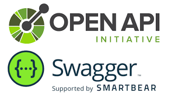

# @devlikeapro/n8n-openapi-node

Turn Your **OpenAPI** (**Swagger**) spec into a **n8n node**!




<!-- toc -->

- [Quick Start](#quick-start)
  * [Installation](#installation)
  * [Usage](#usage)
- [How it works](#how-it-works)
  * [Resource](#resource)
  * [Operation](#operation)
  * [Query Parameters](#query-parameters)
  * [Request Body](#request-body)
  * [Headers](#headers)
- [Customization](#customization)
  * [Resource](#resource-1)
  * [Operation](#operation-1)
  * [Fields](#fields)
- [Use Cases](#use-cases)
- [FAQ](#faq)
  * [I have only OpenAPI v2 spec, what can I do?](#i-have-only-openapi-v2-spec-what-can-i-do)
  * [I have openapi.yaml spec, what can I do?](#i-have-openapiyaml-spec-what-can-i-do)
  * [How to set up credentials from OpenAPI v3 spec?](#how-to-set-up-credentials-from-openapi-v3-spec)
  * [Why it doesn't work with my OpenAPI spec?](#why-it-doesnt-work-with-my-openapi-spec)

<!-- tocstop -->

# Quick Start

## Installation

Add `@devlikeapro/n8n-openapi-node` as dependency

```bash
npm install @devlikeapro/n8n-openapi-node
# OR
pnpm add @devlikeapro/n8n-openapi-node
# OR
yarn add @devlikeapro/n8n-openapi-node
```

👉 We recommend using one of repo for the template:

- https://github.com/devlikeapro/n8n-nodes-petstore - Petstore example generated from OpenAPI v3 spec
- https://github.com/n8n-io/n8n-nodes-starter - Official n8n nodes starter template

Find more real-world examples in [Use Cases](#use-cases) section.

## Usage

1. Add your `openapi.json` to `src/{NodeName}` folder
   (use **OpenAPI v3** and **json**, see [FAQ](#faq) if you don't have it)

2. Get your `Node.properties` from OpenAPI v3 spec:

```typescript
import {INodeType, INodeTypeDescription} from 'n8n-workflow';
import {N8NPropertiesBuilder, N8NPropertiesBuilderConfig} from '@devlikeapro/n8n-openapi-node';
import * as doc from './openapi.json'; // <=== Your OpenAPI v3 spec

const config: N8NPropertiesBuilderConfig = {}
const parser = new N8NPropertiesBuilder(doc, config);
const properties = parser.build()

export class Petstore implements INodeType {
  description: INodeTypeDescription = {
    displayName: 'Petstore',
    name: 'petstore',
    icon: 'file:petstore.svg',
    group: ['transform'],
    version: 1,
    subtitle: '={{$parameter["operation"] + ": " + $parameter["resource"]}}',
    description: 'Interact with Petstore API',
    defaults: {
      name: 'Petstore',
    },
    inputs: ['main'],
    outputs: ['main'],
    credentials: [
      {
        name: 'petstoreApi',
        required: false,
      },
    ],
    requestDefaults: {
      headers: {
        Accept: 'application/json',
        'Content-Type': 'application/json',
      },
      baseURL: '={{$credentials.url}}',
    },
    properties: properties, // <==== HERE
  };
}
```

# How it works

`N8NPropertiesBuilder` extracts few entities from OpenAPI v3 to your n8n community node:

1. **Resource** - a list of **Tags** from OpenAPI spec
2. **Operation** - a list of **Operations** from OpenAPI spec (aka **Actions** in n8n)
3. **Query Parameters** - a list of `operation.parameters` from OpenAPI spec
4. **Request Body** - a list of `operation.requestBody.content` from OpenAPI spec (only for `application/json`)
5. **Headers** - a list of `operation.parameters` from OpenAPI spec

## Resource

By default, it get **Tags** from OpenAPI spec and converts them to **Resource** in n8n.

## Operation

By default, it gets **Operations** from OpenAPI spec and converts them to **Actions** in n8n.

## Query Parameters

It gets `operation.parameters` from OpenAPI spec and converts them to **Query Parameters** in n8n.

## Request Body

It doesn't create the full structure of the request body, only the first level of properties.
So if you have request body as

```json
{
  "name": "string",
  "config": {
    "id": 0,
    "name": "string"
  }
}
```

it creates 2 fields in n8n:

- `name` - with default value `string`
- `config` - with default value `{"id": 0, "name": "string"}`

## Headers

It gets `operation.parameters` from OpenAPI spec and converts them to **Headers** in n8n.

# Customization

## Resource

You can override the way how to extract **Resource** from **OpenAPI Tag** defining your custom `IResourceParser`:

```typescript
import {IResourceParser} from '@devlikeapro/n8n-openapi-node';

export class CustomResourceParser {
  CUSTOM_DESCRIPTION = {
    "cats": "Cats are cute",
  }

  name(tag: OpenAPIV3.TagObject): string {
    // Your custom logic here
    if (tag['X-Visible-Name']) {
      return tag['X-Visible-Name'];
    }
    return lodash.startCase(tag.name);
  }

  value(tag: Pick<OpenAPIV3.TagObject, "name">): string {
    // Remove all non-alphanumeric characters
    const name = tag.name.replace(/[^a-zA-Z0-9_-]/g, '')
    return lodash.startCase(name)
  }

  description(tag: OpenAPIV3.TagObject): string {
    // Your custom logic here
    return this.CUSTOM_DESCRIPTION[tag.name] || tag.description || '';
  }
}
```

Alternatively, you can use `DefaultResourceParser` and override only the methods you need.
The default implementation you can find in [src/ResourceParser.ts](src/ResourceParser.ts)

```typescript
import {OpenAPIV3} from 'openapi-types';
import * as lodash from 'lodash';
import {DefaultResourceParser} from '@devlikeapro/n8n-openapi-node';

export class CustomResourceParser extends DefaultResourceParser {
  value(tag: OpenAPIV3.TagObject): string {
    return lodash.startCase(tag.name.replace(/[^a-zA-Z0-9_-]/g, ''));
  }
}
```

Then you use it in `N8NPropertiesBuilder` in `config.resource`:

```typescript
import {N8NPropertiesBuilder, N8NPropertiesBuilderConfig} from '@devlikeapro/n8n-openapi-node';
import * as doc from './openapi.json';

import {CustomResourceParser} from './CustomResourceParser';

const config: N8NPropertiesBuilderConfig = {
  resource: new CustomResourceParser()
}
const parser = new N8NPropertiesBuilder(doc, config);
const properties = parser.build()
```

Find real example in [@devlikeapro/n8n-nodes-waha](https://github.com/devlikeapro/n8n-nodes-waha) repository.

## Operation

You can override the way how to extract **Operation** from **OpenAPI Operation** defining your custom
`IOperationParser`:

```typescript
import {IOperationParser} from '@devlikeapro/n8n-openapi-node';

export class CustomOperationParser implements IOperationParser {
  shouldSkip(operation: OpenAPIV3.OperationObject, context: OperationContext): boolean {
    // By default it skips operation.deprecated
    // But we can include all operations
    return false
  }

  name(operation: OpenAPIV3.OperationObject, context: OperationContext): string {
    if (operation['X-Visible-Name']) {
      return operation['X-Visible-Name'];
    }
    return lodash.startCase(operation.operationId)
  }

  value(operation: OpenAPIV3.OperationObject, context: OperationContext): string {
    return lodash.startCase(operation.operationId)
  }

  action(operation: OpenAPIV3.OperationObject, context: OperationContext): string {
    // How operation is displayed in n8n when you select your node (right form)
    return operation.summary || this.name(operation, context)
  }

  description(operation: OpenAPIV3.OperationObject, context: OperationContext): string {
    return operation.description || operation.summary || '';
  }
}
```

Alternatively, you can use `DefaultOperationParser` and override only the methods you need.
The default implementation you can find in [src/OperationParser.ts](src/OperationParser.ts)

```typescript
import {DefaultOperationParser} from '@devlikeapro/n8n-openapi-node';

export class CustomOperationParser extends DefaultOperationParser {
  name(operation: OpenAPIV3.OperationObject, context: OperationContext): string {
    // NestJS add operationId in format CatController_findOne
    let operationId: string = operation.operationId!!.split('_').slice(1).join('_');
    if (!operationId) {
      operationId = operation.operationId as string;
    }
    return lodash.startCase(operationId);
  }
}
```

Then you use it in `N8NPropertiesBuilder` in `config.operation`:

```typescript
import {N8NPropertiesBuilder, N8NPropertiesBuilderConfig} from '@devlikeapro/n8n-openapi-node';
import * as doc from './openapi.json';
import {CustomOperationParser} from './CustomOperationParser';

const config: N8NPropertiesBuilderConfig = {
  operation: new CustomOperationParser()
}
const parser = new N8NPropertiesBuilder(doc, config);
const properties = parser.build()
```

Find real example in [@devlikeapro/n8n-nodes-waha](https://github.com/devlikeapro/n8n-nodes-waha) repository.

## Fields

You can override some values for fields at the end, when full `properties` are ready.

Here's example how you can override `session` field value (which has `'default'` string default value) to more n8n
suitable `=${$json.session}}`:

```typescript
import {Override} from '@devlikeapro/n8n-openapi-node';

export const customDefaults: Override[] = [
  {
    // Find field by fields matching
    find: {
      name: 'session',
      required: true,
      type: 'string',
    },
    // Replace 'default' field value
    replace: {
      default: '={{ $json.session }}',
    },
  },
];
```

Then you use it in `N8NPropertiesBuilder`:

```typescript

import {N8NPropertiesBuilder, N8NPropertiesBuilderConfig} from '@devlikeapro/n8n-openapi-node';
import * as doc from './openapi.json';
import {customDefaults} from './customDefaults';

const parser = new N8NPropertiesBuilder(doc);
const properties = parser.build(customDefaults);
```

Find real example in [@devlikeapro/n8n-nodes-waha](https://github.com/devlikeapro/n8n-nodes-waha) repository.

# Use Cases

Here's n8n community nodes generated from OpenAPI specifications you can use for reference:

- [@devlikeapro/n8n-nodes-petstore](https://github.com/devlikeapro/n8n-nodes-petstore) - Petstore example generated from
  [Petstore openapi.json](https://github.com/OAI/OpenAPI-Specification/blob/main/examples/v3.0/petstore.yaml)
- [@devlikeapro/n8n-nodes-chatwoot](https://github.com/devlikeapro/n8n-nodes-chatwoot) - ChatWoot n8n community node
  from
  [https://www.chatwoot.com/developers/api/](https://www.chatwoot.com/developers/api/). Defines credentials as well (
  manually)
- [@devlikeapro/n8n-nodes-waha](https://github.com/devlikeapro/n8n-nodes-waha) - **WAHA** - Self-hosted **WhatsApp HTTP
  API** you can run in a click!

# FAQ

## I have only OpenAPI v2 spec, what can I do?

Paste your OpenAPI 2.0 definition into https://editor.swagger.io and select **Edit > Convert to OpenAPI 3** from the
menu.

https://stackoverflow.com/a/59749691

## I have openapi.yaml spec, what can I do?

Paste your yaml spec to https://editor.swagger.io and select **File > Save as JSON** from the menu.

## How to set up credentials from OpenAPI v3 spec?

Right now you need to define it manually.
Check [ChatWoot node](https://github.com/devlikeapro/n8n-nodes-chatwoot)
for an example.

## Why it doesn't work with my OpenAPI spec?

Open [a new issue](https://github.com/devlikeapro/n8n-openapi-node/issues) and please attach
your openapi.json file and describe the problem (logs are helpful too).


